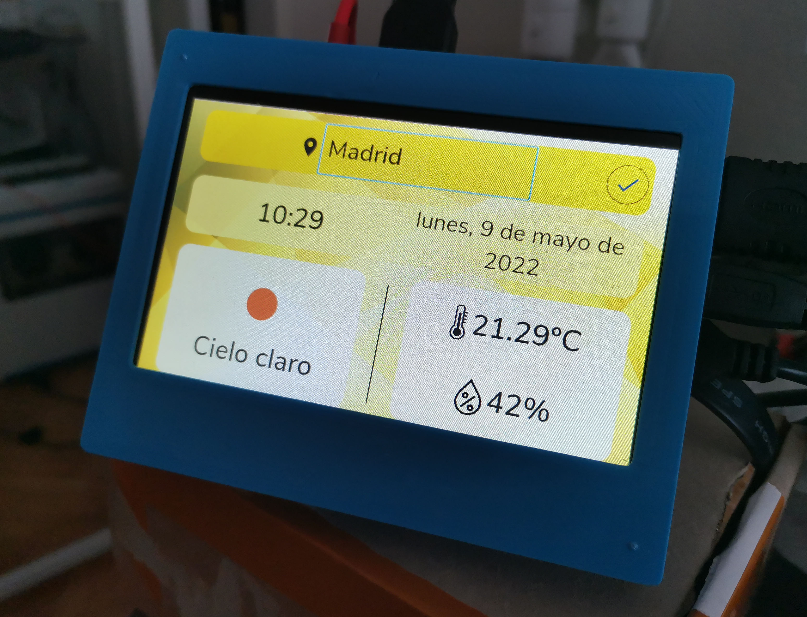
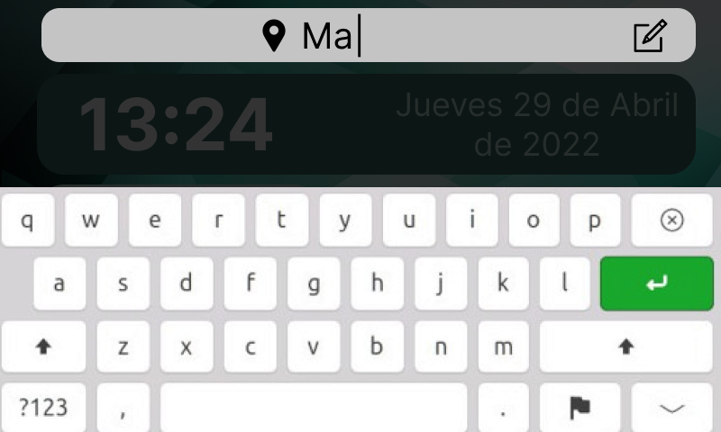

# Boxing_timer
Boxing Timer App written in Flutter and specifically designed for Rapsberry Pi / desktop and SmartTVs.
<!--
<table border="0">
 <tr>
    <td><b>  </b></td>
    <td><b>  </b></td>
 </tr>
</table>
-->

# Environment setup
It also comes with a selfcontained environment. So, it lets you start delevoping in seconds.
You can choose between these 3 modes of use:

* Native.
Open Vscode/Android Studio and develop as usual with your flutter deps already installed.

* Dockerized. Develop inside of a container!
```
git clone <this repo URL>
cd boxing_timer
./init-docker-env.sh
./build.sh
./runApp.sh
```
* Develop in container VsCode. All Vscode dev environment in a container.
```
git clone <this repo URL>
cd boxing_timer
code .
# Click on "reopen in container"
# Start to develop
```

